# CLI Professor 🎓

> **Repositorio**: [https://github.com/I-Talos-I/Talos-Profesor.git](https://github.com/I-Talos-I/Talos-Profesor.git)

Un asistente de CLI inteligente impulsado por **Google Gemini** y **RAG (Retrieval-Augmented Generation)**. para sugerir comandos de terminal basados en lenguaje natural, aprendiendo de tus correcciones pasadas.

## 🚀 Características

*   **Sugerencias Inteligentes**: Traduce "deshacer el último commit" a `git reset --soft HEAD~1`.
*   **Memoria (RAG)**: Recuerda tus preferencias y correcciones anteriores usando una base de datos vectorial.
*   **Formato TOON**: Respuestas optimizadas para ser consumidas por herramientas de CLI (`[CMD:...] [EXP:...]`).
*   **Resiliencia**: Manejo robusto de la API de Gemini con reintentos automáticos (Polly).
*   **Arquitectura Limpia**: Diseño modular siguiendo Domain-Driven Design (DDD).

## 📋 Prerrequisitos

*   [.NET 9 SDK](https://dotnet.microsoft.com/download/dotnet/9.0)
*   [PostgreSQL](https://www.postgresql.org/) (con extensión `vector` habilitada)
*   Una API Key de [Google Gemini](https://ai.google.dev/)

## 🛠️ Configuración

### 1. Clonar el repositorio
```bash
git clone <url-del-repo>
cd TalosProfesor
```

### 2. Variables de Entorno y `appsettings.json`

El proyecto requiere configurar la cadena de conexión a la base de datos y la API Key de Gemini.

**Opción A: `appsettings.json` (Para desarrollo local)**
Edita el archivo `src/CLIProfessor.Api/appsettings.json`:

```json
{
  "ConnectionStrings": {
    "DefaultConnection": "Host=TU_HOST;Port=TU_PUERTO;Database=TU_DB;Username=TU_USUARIO;Password=TU_PASSWORD;Ssl Mode=Require;Trust Server Certificate=true"
  },
  "Gemini": {
    "ApiKey": "TU_API_KEY_DE_GEMINI"
  }
}
```

**Opción B: Variables de Entorno (Recomendado para producción)**
Puedes establecer estas variables en tu sistema operativo o contenedor Docker:

*   `ConnectionStrings__DefaultConnection`: Tu cadena de conexión a PostgreSQL.
*   `Gemini__ApiKey`: Tu clave de API de Google Gemini.

### 3. Base de Datos

El proyecto utiliza Entity Framework Core. Para inicializar la base de datos y aplicar las migraciones:

```bash
# Instalar herramienta localmente si es necesario
dotnet tool restore

# Aplicar migraciones
dotnet tool run dotnet-ef database update --project src/CLIProfessor.Infrastructure/CLIProfessor.Infrastructure.csproj --startup-project src/CLIProfessor.Api/CLIProfessor.Api.csproj
```

## ▶️ Ejecución

Para iniciar la API:

```bash
dotnet run --project src/CLIProfessor.Api
```

La API estará disponible en `https://localhost:7000` (o el puerto configurado).

## 🐳 Docker (Recomendado)

La forma más fácil de ejecutar la aplicación es usando Docker Compose, ya que configura automáticamente la base de datos y la API.

1.  **Configura tu API Key de Gemini**:
    Para no guardar tu clave en el código, usa una variable de entorno.
    
    En Linux/macOS:
    ```bash
    export GEMINI_API_KEY="tu_clave_api_aqui"
    ```
    
    En Windows (PowerShell):
    ```powershell
    $env:GEMINI_API_KEY="tu_clave_api_aqui"
    ```

2.  **Ejecuta la aplicación**:
    ```bash
    docker-compose up --build
    ```

La API estará disponible en `http://localhost:7277`.

## 🔐 Gestión de Secretos (Seguridad)

**IMPORTANTE**: Nunca subas tus contraseñas o API Keys a GitHub.

*   **Para desarrollo local**: Usa [User Secrets](https://learn.microsoft.com/en-us/aspnet/core/security/app-secrets) de .NET o variables de entorno.
*   **Para Docker**: Usa el archivo `.env` (asegúrate de que esté en `.gitignore`) o pasa las variables al ejecutar el contenedor.
*   **En otros PCs**: No copies el archivo `appsettings.json` con claves reales. En su lugar, configura las variables de entorno en esa nueva máquina o crea un archivo `appsettings.json` localmente (sin subirlo al repo).

El archivo `.gitignore` ya está configurado para ignorar `appsettings.Development.json`, pero ten cuidado si modificas `appsettings.json` directamente.

## 📚 Endpoints Principales

### `POST /suggest`
Obtiene una sugerencia de comando.

**Body:**
```json
{
  "naturalLanguageInput": "listar archivos ocultos",
  "context": {
    "os": "Linux",
    "shell": "Bash",
    "currentDirectory": "/home/user"
  }
}
```

**Respuesta (TOON):**
```text
[CMD:ls -a] [EXP:Lista todos los archivos, incluyendo los ocultos.]
```

## 💡 Ejemplo de Uso

Puedes probar la API rápidamente usando `curl` (asegúrate de que la API esté corriendo):

```bash
curl -X POST "https://localhost:7277/suggest" \
     -H "Content-Type: application/json" \
     -d '{
           "naturalLanguageInput": "listar archivos por tamaño",
           "context": {
             "os": "Linux",
             "shell": "Bash",
             "currentDirectory": "/tmp"
           }
         }' -k
```

O utiliza el script de prueba incluido en el repositorio:

```bash
./test_cli.sh "listar archivos por tamaño"
```

## 🏗️ Arquitectura

El proyecto sigue una estructura de **Clean Architecture**:

*   **Domain**: Entidades (`CommandRequest`, `LearnedCorrection`) y lógica de negocio pura.
*   **Application**: Casos de uso (`GetCommandSuggestion`) implementados con CQRS (MediatR).
*   **Infrastructure**: Implementación de servicios externos (Gemini API, EF Core, Pgvector).
*   **Api**: Controladores y Middleware (TOON Formatter).

### 🔄 Flujo de Datos (Sequence Diagram)

```mermaid
sequenceDiagram
    participant User as 👤 Usuario (CLI)
    participant API as 🛡️ API (Controller)
    participant Handler as 🧠 Handler (Application)
    participant VectorDB as 🗄️ Vector Store (PostgreSQL)
    participant Gemini as 🤖 Google Gemini (AI)

    User->>API: POST /suggest ("listar archivos")
    API->>Handler: Send Query (MediatR)
    
    rect rgb(240, 248, 255)
        note right of Handler: 1. RAG (Retrieval-Augmented Generation)
        Handler->>Gemini: Generate Embedding ("listar archivos")
        Gemini-->>Handler: [0.1, 0.5, ...] (Vector)
        Handler->>VectorDB: Search Similar Vectors
        VectorDB-->>Handler: [Correcciones Pasadas]
    end

    rect rgb(255, 250, 240)
        note right of Handler: 2. Construcción del Prompt
        Handler->>Handler: Build Prompt (Persona: Profesor + Contexto + Memoria)
    end

    rect rgb(240, 255, 240)
        note right of Handler: 3. Generación de Respuesta
        Handler->>Gemini: Generate Content (Prompt)
        Gemini-->>Handler: "[CMD:ls] [EXP:Explanation...]"
    end

    Handler-->>API: CommandSuggestionDto
    API-->>User: JSON Response
```



## 📄 Licencia
[MIT](LICENSE)
